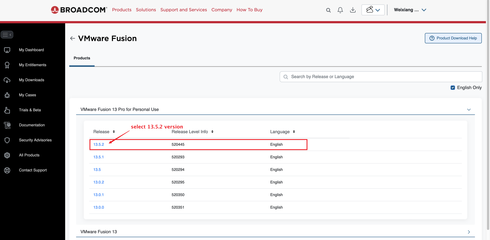

# Fusion Installation for Apple Silicon Machines

- [Step 1: Set Up the Host Apple Machine](#setup-host)
- [Step 2: Install VMWare Fusion Player](#install-fusion)

## <a id="setup-host"></a>Step 1: Set Up the Host Apple Machine

We need to install some software packages on the host Apple machine. 
To do that, we first need to install Homebrew, which
is a package manager for macOS (and Linux, too).
We assume that you already have docker 
install on your Apple machine. If you don't have it, 
please follow [these instructions](https://docs.docker.com/desktop/mac/install/).

### Step 1.1: Install Homebrew

To install Homebrew, open the terminal and run the following command.

```/bin/bash -c "$(curl -fsSL https://raw.githubusercontent.com/Homebrew/install/HEAD/install.sh)"```

If you get this error: ```xcode-select: error:
invalid developer directory '/Library/Developer/CommandLineTools'``` during the installation,
this is because your `Xcode` is not installed or set up properly,
so ```/Library/Developer/CommandLineTools``` is not a valid directory for ```xcode-select```.


You can run the following command in the terminal to further confirm that
there is no active developer directory.

```xcode-select -p```


To solve the problem, you run the following command in the terminal to 
install `xcode-select`:

```xcode-select --install```


If after installing homebrew you are not able to access brew, run the following command in the terminal.

```echo 'eval $(/opt/homebrew/bin/brew shellenv)' >> ~/.zprofile```

```eval $(/opt/homebrew/bin/brew shellenv)```

## <a id="install-fusion"></a>Step 2: Install VMware Fusion Player

VMware Fusion Player is a free virtual machine software. 
It is similar to VirtualBox that we have been using 
for the SEED labs, but VirtualBox still cannot run 
reliably on Apple Silicon machines. 

Go to [VMware Fusion](https://customerconnect.vmware.com/en/evalcenter?p=fusion-player-personal-13) and either log in or register for a basic Broadcom account. 


You will get this page when you registered successfully. You can skip `Build my Profile` for now.


Once logged in Broadcom account, we come back to [Broadcom Support Portal](https://support.broadcom.com/web/ecx/home) if we're not redirected there. We click the `Software` dropdown to choose the `VMware Cloud Foundation division` to select `My Downloads`.


Find `VMware Fusion` in `My Downloads` page.


click `VMware Fusion 13 Pro for Personal Use` dropdown to choose `13.5.2` version.



In Primary Downloads page, find `.dmg` file and click download button to download the dmg file manually.


Installation is straight forward. Double click on the downloaded dmg file and follow the instructions.


After the installation is finished, you can start the VMware Fusion Player. 

You will be asked to enter license key. Select `VMware Fusion Pro for Personal Use`.

You will be asked to allow the kernel extensions. Click on `Open Security Preferences`.

In the Security & Privacy settings, click on `Allow` to allow the kernel extensions.